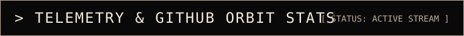
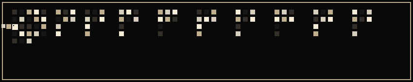

<!-- BACKGROUND AMBIENT SPACE ATMOSPHERE -->

  

<!-- HERO SECTION: FLOATING ASTRONAUT & ORBIT OS GREETING -->

  

<!-- PIXEL SPACE DIVIDER 1 -->

  

<!-- MISSION LOG TERMINAL WINDOW -->

  

<!-- PIXEL MATRIX RAIN ATMOSPHERE -->

  

<!-- TECH ARSENAL SECTION -->

  

<!-- TECH ICONS BADGE BAR (CLEAN & MINIMAL: 7 TECHNOLOGIES ONLY) -->

   &nbsp;&nbsp;&nbsp;&nbsp;&nbsp;
   &nbsp;&nbsp;&nbsp;&nbsp;&nbsp;
   &nbsp;&nbsp;&nbsp;&nbsp;&nbsp;
   &nbsp;&nbsp;&nbsp;&nbsp;&nbsp;
   &nbsp;&nbsp;&nbsp;&nbsp;&nbsp;
   &nbsp;&nbsp;&nbsp;&nbsp;&nbsp;
  

  

<!-- PIXEL SPACE DIVIDER 2 -->

  

<!-- TELEMETRY & GITHUB ORBIT STATS -->

 

<!-- INTEGRATED GITHUB STATS & STREAK (USERNAME: shreyashri1011, MONOCHROME PALETTE: #090909 background, #F5ECD8 text, #BFAF8E title/accents) -->
<table align="center" border="0" cellpadding="0" cellspacing="0" style="background: #090909; border-collapse: collapse;">
  <tr>
    <td align="center" padding="8">
      
    </td>
    <td align="center" padding="8">
      
    </td>
  </tr>
</table>

 

<!-- STREAK STATS (USERNAME: shreyashri1011) -->

  

 

<!-- CONTRIBUTIONS SNAKE ANIMATION -->

  

  

<!-- PIXEL SPACE DIVIDER 3 (COMET DISPLAY) -->

  

 

<!-- RETRO TRANSMISSION / FOOTER -->
<table align="center" width="100%" style="background-color: #090909; border: 2px solid #BFAF8E; border-collapse: collapse;">
  <tr>
    <td align="center" style="padding: 24px;">
       
      
        <b>[ TRANSMISSION END // END OF LINE ]</b>
       
      
        STATION ORBITAL COORDINATES :: SHREYASHRI1011-OS-2026
      
    </td>
  </tr>
</table>

  

