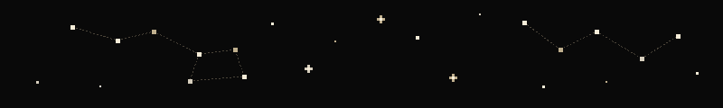
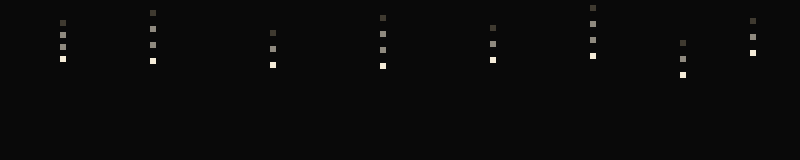
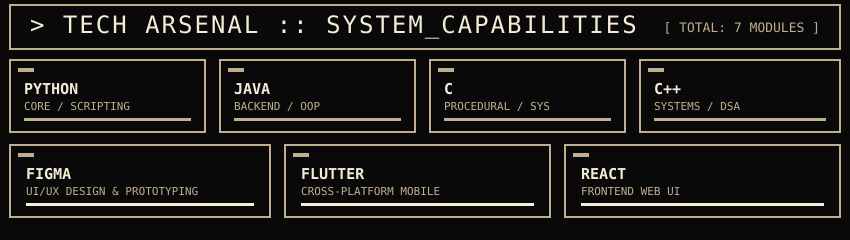
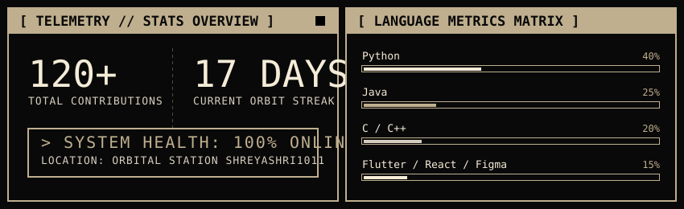
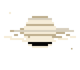

<!-- BACKGROUND AMBIENT SPACE ATMOSPHERE -->

  

<!-- HERO GREETING BANNER -->

   

<!-- PIXEL SPACE DIVIDER 1 -->

   

<!-- MISSION LOG TERMINAL WINDOW -->

   

<!-- PIXEL MATRIX RAIN ATMOSPHERE -->

   

<!-- TECH ARSENAL SECTION -->

  

<!-- TECH ICONS BADGE BAR (CLEAN & MINIMAL: 7 TECHNOLOGIES ONLY) -->

   &nbsp;&nbsp;&nbsp;&nbsp;&nbsp;
   &nbsp;&nbsp;&nbsp;&nbsp;&nbsp;
   &nbsp;&nbsp;&nbsp;&nbsp;&nbsp;
   &nbsp;&nbsp;&nbsp;&nbsp;&nbsp;
   &nbsp;&nbsp;&nbsp;&nbsp;&nbsp;
   &nbsp;&nbsp;&nbsp;&nbsp;&nbsp;
  

   

<!-- PIXEL SPACE DIVIDER 2 -->

   

<!-- RELIABLE INTEGRATED ORBIT TELEMETRY & LANGUAGE MATRIX -->

  

<!-- PIXEL SPACE DIVIDER 3 (COMET DISPLAY) -->

  

  

<!-- RETRO TRANSMISSION / FOOTER -->
<table align="center" width="100%" style="background-color: #090909; border: 2px solid #BFAF8E; border-collapse: collapse;">
  <tr>
    <td align="center" style="padding: 28px;">
       
      
        <b>[ END ]</b>
       
    </td>
  </tr>
</table>

  

